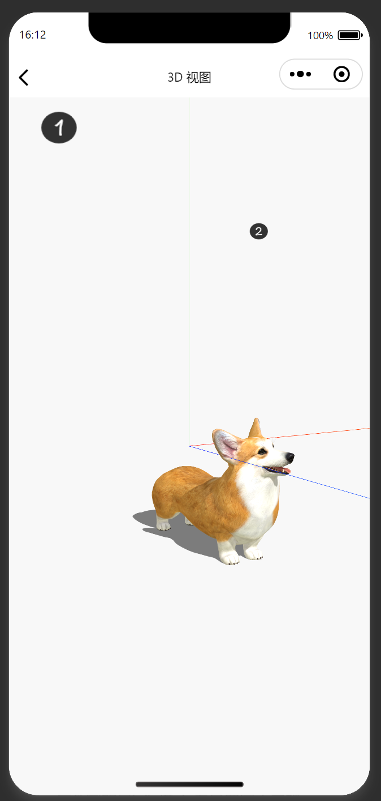
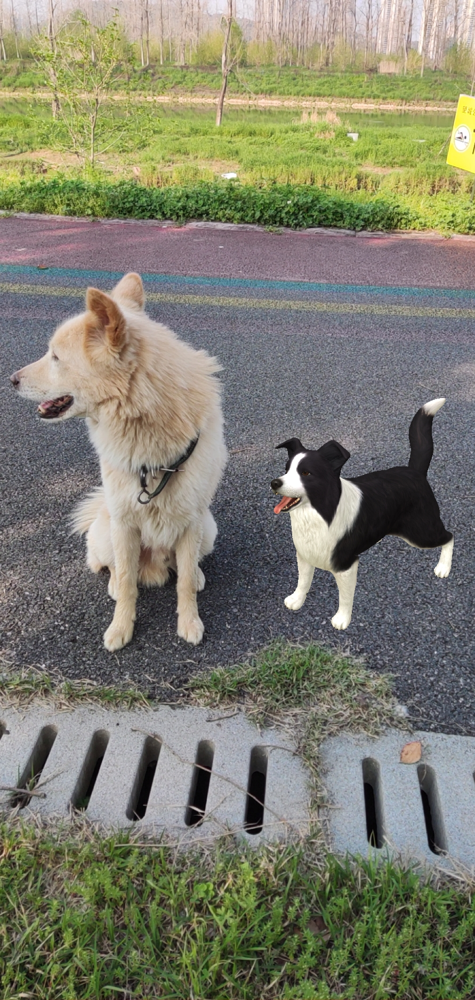

# WeChat 3D（版权登记号：2023SR0599982）

本仓库只开源gltf模型展示技术，技术好的朋友有这些代码就能帮助你解决很多问题了

如需要完整项目（基于若依框架开发的后端，AR能力前端）需另外付费赞助， 联系方式：QQ 790002517

微信公众号：时不待我


## 一点小广告

国内版ChatGPT

https://chatweb.zhangzhiyu.live


## 使用技术


- [Three.js](https://github.com/mrdoob/three.js)

Three.js is a JavaScript 3D library.

- [threejs-miniprogram](https://github.com/wechat-miniprogram/threejs-miniprogram)

There is a WeChat MiniProgram adapted version of Three.js.

-  VisionKit


小程序也在基础库 2.20.0 版本开始提供了开发 AR 功能的能力，即 VisionKit。VisionKit 包含了 AR 在内的视觉算法，要想开发小程序的 AR 功能，我们需要先了解 VisionKit。


## 预览

微信扫码：


## gltf模型展示能力




## 3DAR能力（未开源，需赞助）





## 代码条款

开源内容遵循MIT许可证

付费软件包是基于[MIT 许可证](https://opensource.org/licenses/MIT)提供的，但请勿将其用于分发目的。您可以将代码部署到您的服务器或存储库。但是，您不得公开其他文件，例如源代码、示例、文档等，因为这会抵消赞助软件策略。

| 个人开发者 | ¥100 |
| ---------- | ---- |

如果您退出赞助商，您可以根据需要继续使用这些文件。


## 感谢赞助

<p align="center"><a href="https://github.com"></a>&nbsp;&nbsp;</p>


## glb转gltf模型

Only gltf models can be loaded

You can use the following tool to convert glb to gltf:

```shell
npm install -g gltf-import-export
```

Takes a .glb and exports to a .gltf or takes a .gltf and imports into a .glb.

```shell
Usage: gltf-import-export <file> [options]

Options:
  --version     Show version number                                    [boolean]
  --output, -o  Output filename
  --help, -h    Show help                                              [boolean]
```


