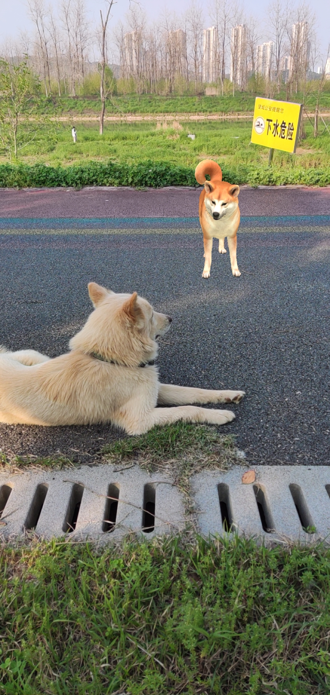

# WeChat 3D（版权登记号：2023SR0599982）

本仓库只开源gltf模型展示技术，技术好的朋友有这些代码就能帮助你解决很多问题了

如需要完整项目（基于若依框架开发的后端，AR能力前端）需另外付费赞助， 联系方式：QQ 790002517

微信公众号：时不待我


## 一点小广告

国内版ChatGPT

https://chatweb.zhangzhiyu.live


## 使用技术


- [Three.js](https://github.com/mrdoob/three.js)

Three.js is a JavaScript 3D library.

- [threejs-miniprogram](https://github.com/wechat-miniprogram/threejs-miniprogram)

There is a WeChat MiniProgram adapted version of Three.js.

-  VisionKit


小程序也在基础库 2.20.0 版本开始提供了开发 AR 功能的能力，即 VisionKit。VisionKit 包含了 AR 在内的视觉算法，要想开发小程序的 AR 功能，我们需要先了解 VisionKit。


## 测试数据


### 回调数据案例json

```
{
    "createTime": "2023-03-10 18:06:05",
    "updateTime": "2023-03-29 08:38:46",
    "animalId": 3,
    "animalName": "秋田犬",
    "animalIntroduction": "<p style=\"text-indent: 2em;\">\r\n    <span style=\"font-size: 14px;\">秋田犬（日语：秋田犬／あきたいぬ／アキタイヌ&nbsp;），别名“大馆犬”，是日本犬的一种，是国家天然纪念物之六种日本犬中唯一的大型犬种。在日本，送秋田犬的雕像、图片代表着“祝你早日康复”。在日本是以对饲主忠诚闻名的家庭宠物犬，日本知名的忠犬八公即为秋田犬。</span>\r\n</p>",
    "animalDetailed": "<p style=\"text-indent: 2em; text-align: left;\">\r\n    <span style=\"font-size: 14px;\">秋田犬（日语：あきたいぬ/アキタイヌ）是原产于日本的一种大型狐狸犬种，也称日本秋田犬。该犬体型中等，公犬身高66.0～71.1厘米，母犬身高61.0～66.0厘米，尾巴向前卷曲紧贴于背上，竖耳；身体机构紧凑，有力，骨架结实；颜色多样，包括白色、有斑纹和花点的都有。该犬十分勇猛、感觉锐敏、忠诚且聪明。其发祥地为秋田县，该地区北部多山，而且冬季十分寒冷。</span>\r\n</p>\r\n<p style=\"text-align:center\">\r\n    <span style=\"font-size: 14px;\"></span>\r\n</p>\r\n<p style=\"text-indent: 2em; text-align: left;\">\r\n    <span style=\"font-size: 14px;\">秋田犬是一种影响颇大的犬，它们在日本犬中占有统治地位。过去，只有贵族可以驯养这种犬来捕猎野熊、鹿和日本黑熊；它们也曾充当斗犬。现代的秋田犬可充当警犬和军犬，也是种很好的护卫犬、家庭宠物犬。在日本，秋田犬是具有国家历史文物意义的犬，属国犬，因“忠犬八公”闻名于世，是日本指定的国家天然纪念物中唯一的大型犬。</span>\r\n</p>",
    "animalType": null,
    "animalImage": "动物图片链接.jpeg",
    "animalGenus": "{\"性情\":\"Receptive，忠贞，沈着，固执，机智，忠诚，勇敢\",\"毛色\":\"布林达色，芝麻色，Red Fawn\",\"平均寿命\":\"10至12年\",\"原产地\":\"日本\"}",
    "modelId": 13,
    "sysModel": {
      "createTime": "2023-03-10 18:06:05",
      "updateTime": "2023-03-29 08:38:46",
      "modelId": 13,
      "modelName": "秋田犬",
      "modelUrl": "gltf模型链接.gltf",
      "sound": "1",
      "modelSource": "google",
      "soundUrl": "模型声音MP3链接.mp3",
      "modelArSize": null,
      "modelSize": "{\"x\":\"3.8\",\"y\":\"3.8\",\"z\":\"3.8\"}",
      "modelPosition": "{\"x\": -0.2,\"y\": -2,\"z\": 0}",
      "modelBearing": null,
      "modelInteraction": "[1,2]",
      "modelImage": "动物详情页模型动态视频.mp4",
      "interactions": [
        {
          "createTime": "2023-03-11 15:10:38",
          "updateTime": "2023-04-01 22:33:58",
          "interactionId": 1,
          "interactionPosition": "{\"x\":-2,\"y\":5,\"z\":0}",
          "interactionW": "<p>\r\n    你是<strong style=\"color: #FFFC00;text-shadow: 0px 1px 1px rgb(0 0 0 / 25%);font-weight: normal;\">「嘿嘿嘿侦探社」</strong>的实习侦探 ‍，接到上级指派任务，到<strong style=\"color: #FFFC00;text-shadow: 0px 1px 1px rgb(0 0 0 / 25%);font-weight: normal;\">「甄开心小镇」</strong>调查市民<strong style=\"color: #FFFC00;text-shadow: 0px 1px 1px rgb(0 0 0 / 25%);font-weight: normal;\">「甄不戳」</strong>宝石 失窃案，根据线人<strong style=\"color: #FFFC00;text-shadow: 0px 1px 1px rgb(0 0 0 / 25%);font-weight: normal;\">「流浪汉老石」</strong>提供的线索，小偷就躲在小镇，快把他找出来，帮甄不戳寻回失窃的宝石吧！\r\n</p>",
          "interactionSequence": "交互点图案1链接.png"
        },
        {
          "createTime": "2023-03-11 15:11:03",
          "updateTime": "2023-04-01 22:34:54",
          "interactionId": 2,
          "interactionPosition": "{\"x\":5,\"y\":5,\"z\":-5}",
          "interactionW": "<p>\r\n    我是<strong style=\"color: #FFFC00;text-shadow: 0px 1px 1px rgb(0 0 0 / 25%);font-weight: normal;\">「动物知识派对小程序」</strong>的动物 ‍，更多信息等待后续开发吧！\r\n</p>",
          "interactionSequence": "交互点图案2链接.png"
        }
      ]
    }
  }
```


#### 模型属性

| 名称             | 类型                                                         | 必选  | 约束 | 中文名 | 说明                    |
| ---------------- | ------------------------------------------------------------ | ----- | ---- | ------ | ----------------------- |
| interactions     | [[创建SysInteraction的请求参数](#schema%e5%88%9b%e5%bb%basysinteraction%e7%9a%84%e8%af%b7%e6%b1%82%e5%8f%82%e6%95%b0)] | false | none |        | 交互点                  |
| modelArSize      | string                                                       | false | none |        | 模型AR大小              |
| modelBearing     | string                                                       | false | none |        | 模型方位                |
| modelId          | integer(int64)                                               | false | none |        | 模型ID                  |
| modelImage       | string                                                       | false | none |        | 模型图片URL             |
| modelInteraction | string                                                       | false | none |        | 模型交互点数组          |
| modelName        | string                                                       | false | none |        | 模型名字                |
| modelPosition    | string                                                       | false | none |        | 模型位置                |
| modelSize        | string                                                       | false | none |        | 模型大小                |
| modelSource      | string                                                       | false | none |        | 模型来源                |
| modelUrl         | string                                                       | false | none |        | 模型URL                 |
| sound            | string                                                       | false | none |        | 模型URL(0表示无1表示有) |
| soundUrl         | string                                                       | false | none |        | 模型声音URL             |


#### 交互点属性

```json
{
  "createTime": "2019-08-24T14:15:22Z",
  "interactionId": 0,
  "interactionPosition": "string",
  "interactionSequence": "string",
  "interactionW": "string",
  "updateTime": "2019-08-24T14:15:22Z"
}

```


| 名称                | 类型           | 必选  | 约束 | 中文名 | 说明     |
| ------------------- | -------------- | ----- | ---- | ------ | -------- |
| interactionId       | integer(int64) | false | none |        | 交互ID   |
| interactionPosition | string         | false | none |        | 交互位置 |
| interactionSequence | string         | false | none |        | 交互顺序 |
| interactionW        | string         | false | none |        | 交互文案 |


#### 动物属性

```json
{
  "animalDetailed": "string",
  "animalGenus": "string",
  "animalId": 0,
  "animalImage": "string",
  "animalIntroduction": "string",
  "animalName": "string",
  "animalType": "string",
  "createTime": "2019-08-24T14:15:22Z",
  "modelId": 0,
  "sysModel": {
    "createTime": "2019-08-24T14:15:22Z",
    "interactions": [
      {
        "createTime": "2019-08-24T14:15:22Z",
        "interactionId": 0,
        "interactionPosition": "string",
        "interactionSequence": "string",
        "interactionW": "string",
        "updateTime": "2019-08-24T14:15:22Z"
      }
    ],
    "modelArSize": "string",
    "modelBearing": "string",
    "modelId": 0,
    "modelImage": "string",
    "modelInteraction": "string",
    "modelName": "string",
    "modelPosition": "string",
    "modelSize": "string",
    "modelSource": "string",
    "modelUrl": "string",
    "sound": "string",
    "soundUrl": "string",
    "updateTime": "2019-08-24T14:15:22Z"
  },
  "updateTime": "2019-08-24T14:15:22Z"
}

```


| 名称               | 类型                                                         | 必选  | 约束 | 中文名 | 说明     |
| ------------------ | ------------------------------------------------------------ | ----- | ---- | ------ | -------- |
| animalDetailed     | string                                                       | false | none |        | 动物详情 |
| animalGenus        | string                                                       | false | none |        | 动物属科 |
| animalId           | integer(int64)                                               | false | none |        | 动物ID   |
| animalImage        | string                                                       | false | none |        | 动物图片 |
| animalIntroduction | string                                                       | false | none |        | 动物简介 |
| animalName         | string                                                       | false | none |        | 动物名   |
| animalType         | string                                                       | false | none |        | 动物类别 |
| modelId            | integer(int64)                                               | false | none |        | 模型ID   |
| sysModel           | [创建SysModel的请求参数](#schema%e5%88%9b%e5%bb%basysmodel%e7%9a%84%e8%af%b7%e6%b1%82%e5%8f%82%e6%95%b0) | false | none |        | 模型对象 |


### 示例模型

链接: https://pan.baidu.com/s/1TqjHHweITVKBxhCi5geZVQ 提取码: 62kb 


## 预览

微信扫码：


## gltf模型展示能力


## 3DAR能力（未开源，需赞助）




## 代码条款

开源内容遵循MIT许可证

付费软件包是基于[MIT 许可证](https://opensource.org/licenses/MIT)提供的，但请勿将其用于分发目的。您可以将代码部署到您的服务器或存储库。但是，您不得公开其他文件，例如源代码、示例、文档等，因为这会抵消赞助软件策略。

| 项目 | 赞助金额 |
| ------------ | ---- |
| 技术支持     |  ¥100   |
| AR及后台代码 |   ¥100   |

如果您退出赞助商，您可以根据需要继续使用这些文件。


## 感谢赞助

<p align="center"><a href="https://github.com"></a>&nbsp;&nbsp;</p>


## glb转gltf模型

Only gltf models can be loaded

You can use the following tool to convert glb to gltf:

```shell
npm install -g gltf-import-export
```

Takes a .glb and exports to a .gltf or takes a .gltf and imports into a .glb.

```shell
Usage: gltf-import-export <file> [options]

Options:
  --version     Show version number                                    [boolean]
  --output, -o  Output filename
  --help, -h    Show help                                              [boolean]
```


